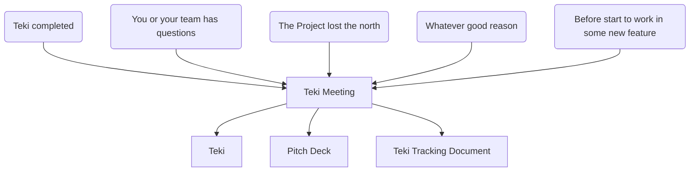

# Teki 滴
Teki is a one meeting methodology for projects building.
Teki means drop (of water) in Japanese. The main idea is doing small progress day by day in the process of building your project.

**This methodology is ideal for:**

* Small teams without full time to dedicate.
* Track the progress so that prevent to lose the north
* Share the past decisions to new members or stakeholders
* Projects that depends on people feedback (video games, social movements, events, etc)
* Projects that wants or need fast learning and progress

## Values

### 🥁 Pacing

Keep the rhythm of the project...

### 🧐 Focus

...Doing the right things...

### 📢 Communication

...And telling everyone why, how, when and what you are doing.

## Definitions

| Term | Definition |
| ---- | ---------- |
| **Project** | Could be anything from a rock band to a mission to mars |
| **Teki** | Small iteration of progress. |
| **Teki Tracking Document** | An historical record of all the Tekis. |
| **Pitch Deck** | Small Presentation that contains the most important things of the project. |
| **The Problem** | What is causing pain to your customers, now or in the future. |
| **Customer** | The humans that are going to use your solution. |
| **The Solution** | What your customers love to use, because solve its problem. |
| **The Market** | The group of humans that has the same problem that your customers |
| **Traction** | Evidence that your customers actually love your solution. Payments, downloads, follows, etc. |
| **Infrastructure** | The physical or virtual environment that you are working with. |

## How to use it

Teki consist in one single meeting. This meeting needs to be done every week, but you can have it in any moment inside the week if you need.

## Stages
One important thing before start every Teki is being aware of what is the stage of your project:

### 💡 Ideation

#### Goals

* Discovering initial Problem.
* Discovering the initial Market.
* Discovering the initial Solution.
* Create your first Pitch Deck

#### Timing

3 months maximum (This obviously depends on the type of your project)

### 🌱 Starting 
AKA: Minimum Viable Product/Project (MVP)

#### Goals

* Create your MVP
* Understanding your market
* Understanding the problem you are trying to solve
* Having initial traction
* You know that your team is able to solve the problem

#### Timing

6 months to 3 years

### 🧩 Tuning
AKA: Product Market Fit (PMF)

#### Goals

* Increase you customer satisfactions
* Your solution shall be the best possible in the market

### 🌳 Growing

#### Goals

* Refine your marketing strategy
* Increase your traction
* Improve your infrastructure

## Teki Meeting

### Before start

Every member of the team has to be prepared for the meeting

1. You are not an expert (If you were you don't need Teki and probably you have your project completed or your startup is already successful), so don't assume nothing
2. Prepare the data for the meeting. What data? any kind of data: interviews, analytics, meetings, comments, etc, better if comes from your customer/client. Don't you have clientes? See next point.
3. Client: you, your friends, your colleagues, your family, people in forums, etc.
4. Use a monthly or single document (Confluence, Wiki, source code, word, google docs) to track the progress.

### Topics

#### Questions

#### Answers
What the team learned since the last meeting, The most important learning should be took **from the client**, but every kind of learning is welcome. Write all the learnings

#### Data
Present the data you have collected in the last Teki. Write down the most important part.

#### Ideas
Write all the ideas that comes from Learnings and Data first, finally your ideas.

#### Tasks
why yes, goals whay are you trying to answer

#### Pending tasks
why not

#### Taks done
