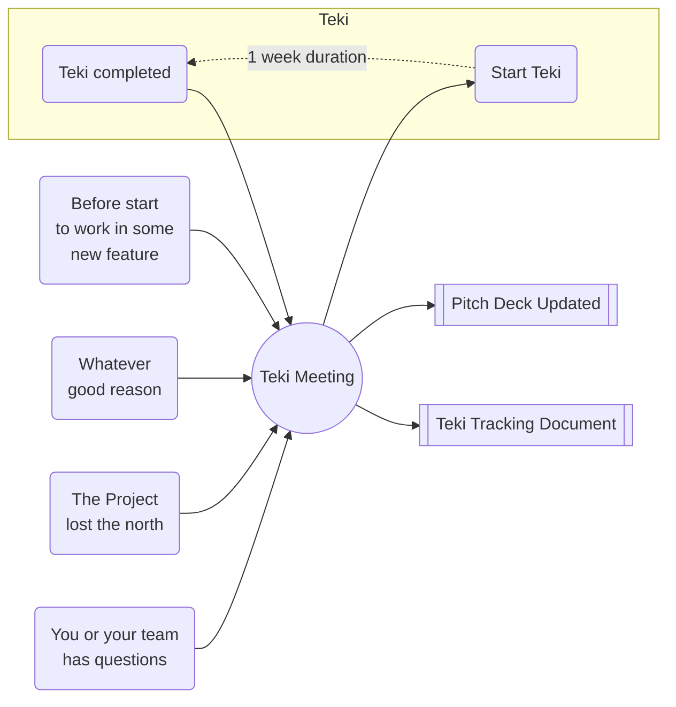

# Teki 滴
Teki is a one meeting methodology for projects building.
Teki means drop (of water) in Japanese. The main idea is doing small progress day by day in the process of building your project.

**This methodology is ideal for:**

* Small teams without full time to dedicate.
* Track the progress so that prevent to lose the north
* Share the past decisions to new members or stakeholders
* Projects that depends on people feedback (video games, social movements, events, etc)
* Projects that need fast learning and progress

## Values

### 🥁 Pacing

Keep the rhythm of the project having small progress every week.

### 🧐 Focus

Working only in the right things.

### 📢 Communication

Telling your team and stakeholders why, how, when and what you are doing.
Telling your customers why and what you are doing.

## Definitions

| Term | Definition |
| ---- | ---------- |
| **Project** | Could be anything from a rock band to a mission to mars |
| **Teki** | Small iteration of progress. Minimum duration is **1 week** |
| **Teki Tracking Document** | An historical record of all the Tekis, that can be shared with the team and stakeholders. |
| **Pitch Deck** | Small Presentation that contains the most important things of the project and can be shared with the stakeholders and your customers (with some modifications). |
| **The Problem** | What is causing pain to your customers, now or in the future. |
| **Customer** | The humans that are going to use your solution. Hey! this can be you or friends in the begining. |
| **The Solution** | What your customers love to use, because solve their problem. |
| **Market** | The group of humans arround the world that have the same problem that your customers |
| **Traction** | Evidence that your customers actually love your solution. Payments, downloads, follows, etc. |
| **Team** | The humans that are working on your project, directly or indirectly. |
| **Stakeholders** | The humans that have a strong interest in your project, but are not part of the team. |
| **Progress** | Small amount of improvement in the solution, that can be shared with the team, stakeholders or customers. |
| **Infrastructure** | The physical or virtual environment that you are building or using. Applications, services, methodologies, etc. |


## How to use it

Teki iteration start with one single meeting, that happens every week. But you can have it in any moment inside the week if you need.



## Stages
One important thing before start every Teki is being aware of what is the stage of your project. So if you already reached the goals of some stage, you could know that you are in the next stage. This is super important to prioritize your work and keep the focus.

### 🥚 Ideation 🥑

#### Goals

* Discovering initial Problem.
* Discovering the initial Market.
* Discovering the initial Solution.
* Create your first Pitch Deck

#### Timing

3 months maximum (This obviously depends on the type of your project)

### 🐣 Starting 🌱
AKA: Minimum Viable Product/Project (MVP)

#### Goals

* Create your MVP
* Understanding your market
* Understanding the problem you are trying to solve
* Having initial traction
* You know that your team is able to solve the problem

#### Timing

6 months to 3 years

### 🐥 Tuning 🪴
AKA: Product Market Fit (PMF)

#### Goals

* Increase you customer satisfactions
* Your solution shall be the best possible in the market

### 🐓 Growing 🌳

#### Goals

* Refine your marketing strategy
* Increase your traction
* Improve your infrastructure

## Before start

Every member of the team has to be prepared for the meeting

1. You are not an expert (If you were you don't need Teki and probably you have your project completed or your startup is already successful), so don't assume nothing. Even if you belive that you already know it, stay open and curious.
2. Prepare the __traction__ data for the meeting. What data? any kind of data: interviews, analytics, meetings with customers, experts opinions, research, comments, etc, better if comes from your customer.
4. Create a document in the cloud (avoid saving it only in your computer) with this format ```#(number of meeting) - Date(more text is better)``` for example:
    - ```1 - May 3 2020```
    - ```2 - Monday, May 15 2020```
    - ```3 - 2020/March/15```


### Some questions before start

| Question | Answer |
| ---- | ---- |
| Who run the meeting? | The founder of the project shall to run the meeting. |
| How long is the meeting? | 10 to 20 minutes |
| How many pages should have the Teki Tracking Document? | 1 to 2 |

## Topics

### 1. Questions ❓

Write down all the new questions you and your team have about the project.

Rock band examples:

* How much time am I going to spend on this project?
* Do my customers wants to hear my recent song before the musical video?
* How much it cost to produce a video?
* How much my customers are going to love my song?

Mission to mars examples:

* I'm able to reach the moon?
* What materials do I need to build the rocket?
* Is there customers that need to go to mars?

It doesn't matter how big the questions are or how ridiculous they are, having all the questions would make way more easy to identify what is the most important thing you should be doing in your project.

### 2. Ideas 🎈
Write all the amazing ideas you have for the next Teki, and for the hole project. Remember you only have 20 minutes maximum so try to keep it simple.

Rock band examples:

* We want to be the best rock band in australia.
* What if we mix some native sounds with the rock band?
* Create the logo of the band.
* Make a youtube channel of the band.

Mission to mars examples:

* Design a rocket that can reach the moon.
* Create a 1 year plan with the building process of the rocket.
* Do the maths to calculate the phisics of the rocket.


### 5. Tasks ✅
why yes, goals whay are you trying to answer

### 3. Traction 📊
Present the data you have collected in the last Teki. Write down the most important part.

### 2. Answers 💧
What the team learned in the last Teki, The most important learning should come **from the client**, but every kind of learning is welcome. Write all the learnings

### 6. Pitch Deck 🎪
