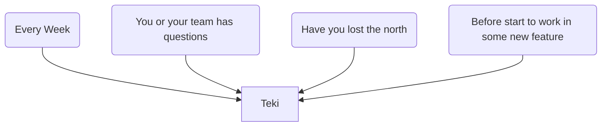

# Teki 滴
Teki is a one meeting methodology for projects creation.
Teki means drop (of water) in Japanese. The main idea is doing small progress day by day in the process of building your project.

**This methodology is ideal for:**

* Small teams without full time to dedicate.
* Track the progress so that prevent to lose the north
* Share the past decisions to new members or stakeholders
* Projects that depends on people feedback (video games, social movements, events, etc)
* Projects that wants or need fast learning and progress

## Key concepts

**Pacing**

**Focus**

**Communication**

****

## How to use it

Teki consist in one single meeting. This meeting needs to be done every week, but you can have it in any moment inside the week if you need.

Teki consist in a daily or weekly meeting with your team where you ask, write, the right things.
And that's it, only a continuous improvement documented process. The idea is to keep the things super simple.

## Stages

One important thing before start is being aware of what are the stage of your project/startup:

* **Early**: Conceptualization / Idea validation / Idea discovery
* **MVP**: Minimum valuable product / Discovering what is about your project startup
* **PMF**: Product Market fit / Discovering if there is a match between the market and your product (startup)
* **Marketing: Growth** ... (I don't have any experience with this part)

In every stage you have to undersand that your goal is different so don't waste your time to get hundreds of clients if you not even know what’s your product, what's your market and what you want.

## Teki meeting

### Before start

Every member of the team has to be prepared for the meeting

1. You are not an expert (If you were you don't need Teki and probably you have your project completed or your startup is already successful), so don't assume nothing
2. Prepare the data for the meeting. What data? any kind of data: interviews, analytics, meetings, comments, etc, better if comes from your customer/client. Don't you have clientes? See next point.
3. Client: you, your friends, your colleagues, your family, people in forums, etc.
4. Use a monthly or single document (Confluence, Wiki, source code, word, google docs) to track the progress.

### Topics

#### Data
Present and analyse the data you have since the last meeting. Create a summary of that data and the analysis in the document.

#### Answers
What the team learned since the last meeting, The most important learning should be took **from the client**, but every kind of learning is welcome. Write all the learnings

#### Questions

#### Ideas
Write all the ideas that comes from Learnings and Data first, finally your ideas.

#### Next tasks
why yes, goals whay are you trying to answer

#### Pending tasks
why not

#### Taks done
