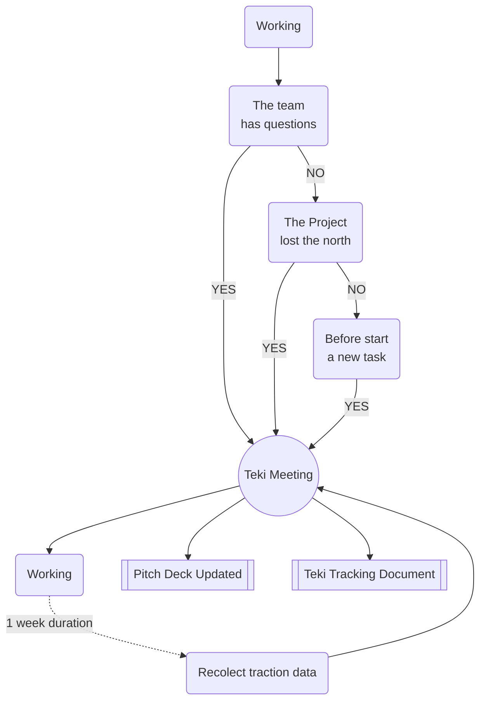

# Teki 滴

> “Dripping water hollows out stone, not through force but through persistence.” ― Ovid

Teki is a one meeting methodology for projects building. Teki means drop (of water) in Japanese. The idea is doing small progress day by day in the process of building your project.

**This methodology is ideal for:**

* Small teams without full time to dedicate.
* Track the progress so that prevent to lose the north
* Share the past decisions to new members or stakeholders
* Projects that depends on people feedback (video games, social movements, events, etc)
* Projects that need fast learning and progress

## Values

### Pacing 🥁 

Keep the rhythm of the project having small progress every week.

### Focus 🧐 

Working only in the right things.

### Communication 📢 

Telling the team and stakeholders why, how, when and what you are doing.
Telling your customers why and what you are doing.

## Definitions

| Term | Definition |
| ---- | ---------- |
| **Project** | Could be anything from a rock band to a mission to mars |
| **Teki** | Small iteration of progress. Minimum duration is **1 week** |
| **Teki Tracking Document** | An historical record of all the Tekis, that can be shared with the team and stakeholders. |
| **Pitch Deck** | Small Presentation that contains the most important things of the project and can be shared with the stakeholders and your customers (with some modifications). |
| **The Problem** | What is causing pain to your customers, now or in the future. |
| **Customer** | The humans that are going to use your solution. Hey! this can be you or friends in the begining. |
| **The Solution** | What your customers love to use, because solve their problem. |
| **Target Market** | The group of humans arround the world that have the same problem that your customers |
| **Market** | The group of humans arround the world that have the same problem that your customers |
| **Traction** | Evidence that your customers love your solution. Payments, downloads, follows, etc. |
| **Team** | The humans that are working on your project, directly or indirectly. |
| **Stakeholders** | The humans that have a strong interest in your project, but are not part of the team. |
| **Progress** | Small amount of improvement in the solution, that can be shared with the team, stakeholders or customers. |
| **Infrastructure** | The physical or virtual environment that you are building or using. Applications, services, methodologies, etc. |
| **Iteration** | 
| **


## How to use it

Teki iteration start with one single meeting, that happens every week. But you can have it in any moment inside the week if you need.



<!-- start_teki -.-> start_teki2 -->

## Stages
One important thing before start every Teki is being aware of what is the stage of your project. So if you already reached the goals of some stage, you could know that you are in the next stage. This is super important to prioritize your work and keep the focus.

### Ideation 🥑 🥚

#### Goals

* Discovering initial Problem.
* Discovering the initial Market.
* Discovering the initial Solution.
* Create your first Pitch Deck

#### Timing

3 months maximum (This obviously depends on the type of your project)

### Starting 🌱 🐣
AKA: Minimum Viable Product/Project (MVP)

#### Goals

* Create your first Solutions
* Understanding your market
* Understanding the problem you are trying to solve
* Having initial traction
* You know that your team is able to solve the problem

#### Timing

6 months to 3 years

### Tuning 🪴 🐥
AKA: Product Market Fit (PMF)

#### Goals

* Increase you customer satisfactions
* Your solution shall be the best possible in the market

### Growing 🌳 🐓

#### Goals

* Refine your marketing strategy
* Increase your traction
* Improve your infrastructure

## Before start

Every member of the team has to be prepared for the meeting

1. You are not an expert (If you were you don't need Teki and probably you have your project completed or your startup is already successful), so don't assume nothing. Even if you belive that you already know it, stay open and curious.
2. Prepare the __traction__ data for the meeting. What data? any kind of data: interviews, analytics, meetings with customers, experts opinions, research, comments, etc, better if comes from your customer.
4. Create a document in the cloud (avoid saving it only in your computer) with this format ```#(number of meeting) - Date(more text is better)``` for example:
    - ```1 - May 3 2020```
    - ```2 - Monday, May 15 2020```
    - ```3 - 2020/March/15```


### Some questions before start

| Question | Answer |
| ---- | ---- |
| Who run the meeting? | The founder of the project shall to run the meeting. |
| How long is the meeting? | 10 to 20 minutes |
| How many pages should have the Teki Tracking Document? | 1 to 2 |

### Document template

```
Stage:
1. Questions
2. Ideas
3. Tasks
4. Traction
5. Answers
6. Pitch Deck
```

## Topics

### 1. Questions ❓

Write down all the new questions you and your team have about the project.

##### Rock band examples:

* How much time am I going to spend on this project?
* Do my customers wants to hear my recent song before the musical video?
* How much it cost to produce a video?
* How much my customers are going to love my song?

##### Mission to mars examples:

* I'm able to reach the moon first?
* What materials do I need to build the rocket?
* Is there customers that need to go to mars?

It doesn't matter how big the questions are or how ridiculous they are, having all the questions would make way more easy to identify what is the most important thing you should be doing in your project.

### 2. Ideas 🎈
Write all the amazing ideas you have for the next Teki, and for the hole project. Remember you only have 20 minutes maximum so try to keep it simple.

##### Rock band examples:

* We want to be the best rock band in australia.
* What if we mix some native sounds with the rock band?
* Create the logo of the band.
* Make a youtube channel of the band.

##### Mission to mars examples:

* Design a rocket that can reach the moon.
* Create a 1 year plan with the building process of the rocket.
* Do the maths to calculate the phisics of the rocket.


### 3. Tasks ✅

This is one of the most important parts of the Teki meeting, so be sure you have plenty of time to do it.

#### 3.1 Select the most important question
The first thing that you need to do is detect what is the most important question you have. How could you know that?. Just select the question that separete your solution from the customer the most.

##### Rock band examples:

> * How much time am I going to spend on this project? 

This question for example is probably the most important because if you don't know how much time you are going to spend on this project, you will not be able to know if you are going to be able to finish it in time. The lack of this answer is separating you from showing your solution to your customer.

Kowing the other anser otherwize is not super important right now, because you don't even know the time you will use in your project.

##### Mission to mars examples:

Here is most difficult, because some of you could think that knowing the materials is the most important question. Because if you don't know that you never are going to acomplish your mission to mars. But that is not necessarily true. 

Do you really need to build your own rocket to travel to mars?
Have you researched if there is some other company that is actually selling rockets that are able to go mars?

In this part of the meeting is so important that the team reconcidered their questions. Remember that you are traveling blind through a forest full of challenges. Your real goal as project founder is to make something that other people will want to use. You can build tons of rockets if you want but that is what you want or need, not what your customers want.

If you are building something only because you want to use your free time and have some fun, if your are not planning to show your solution to customers, probably Teki can't be so helpful.

> * Is there customers that need to go to mars?

That been said, I would select this question as the most important. If there is no one that wants to go to mars, you will be trying to build something that will not be used by anyone.

#### 3.2 Define the task you are going to do this week

##### Rock band 🎸:

> * How much time am I going to spend on this project? 

How could you answer that question? You probably need to just try to make some music in the week and track the time you spended on it. Or you could need ask your boss or your parents if you can dedicate some time of your duties to this project.

So the task you are going to do is something like

* This week I will track the hours I would spend on this project. Because is the easiest way to know how much time you are going to spend on this project. So that I could countinue with the rock band project and show my music to my fans. 
   * I need a notebook to trak the time.
* Today I will ask to my parents how much time I can spend on this project. Because I have weekly duties and I would like to have my parents support and permission. So that I will be able to shoy my music.

**Be sure your tasks include:**

1. When you expect to finish.
2. What you are going to do. Including sub tasks.
3. A way to know you are done.
4. Why this task is the best option to answer the question.
5. The results you expect of the task.
6. Part of the task is recopilate the traction data.

##### Mission to mars 🚀:

Ok so we selected

> * Is there customers that need to go to mars?

I'm not going to go with the tipical _make a poll_. Or the other one _create a landing page_. Let's go more creative.

* This night I will send a fun payed message in four twitch channels asking if anyone would like to go to mars. Bacause I will get the chat and streamer feedback. So that I can have a better idea if there is potential customers.
   * We need to create 4 very specific messages to be sent.
   * We need to select 4 streamears that tipically stream tonight.

* This Wednesday I will go to the college and ask in five science classes if anyone would like to go to mars. Because I will get the feedback from the science students and professors. So that I can show to this potential market my ideas.
   * We need to contact 5 teachers in the college.
   * We need to ask for permission in the college.
   * We need to create at least 6 big pictures of mars to show to the students.

But the way this two tasks have sense if you already know more or less what could be your market. Probably in a twitch channel you won't find people that want to go to mars (and pay for it). 

You can be super creative or go for the tipical ideas. Any option is fine. The real goal here is to do something that can help you to answer your questions, help you to fill the lack of information that you need to build your solution.

### 4. Traction 📊

Make a list of all the traction data you collected in the last week. This could be excel files, images, stats, or audio files. Any kind of evidence is valid.

It's super important have the full list in all the documents, you can remove the evidence that could be repeated or is not relevant any more (Remember you only should have 2 pages in the document).

##### Rock band 🎸:

So let's say the rock band completed the week tasks they had.

So they can have these tracktion data:

* The amount of time they spent on the project.
* The amount of time my parents allow me to spend on this project.

##### Mission to mars 🚀:

* Chat screen captures.
* Clip of the comment of the streamer.
* Record of the students opinions.

### 5. Answers 💧

So now you can start to answer some questions. Writing the answers help you to understand your mistakes and hits in your project story.

##### Rock band 🎸:

* How much time am I going to spend on this project?
    * According to my one week track and my parents permission I will spend 10 hours per week.

##### Mission to mars 🚀:

* Is there customers that need to go to mars?
    * Some users of XQC appears to be interested, 5 of them showed an interest in actually purchase the tickets.
    * Zero biology students (in UNSW Sydney) showed interest in going to mars.
    * 1 physics student (in UNSW Sydney) showed interest in going to mars.
    * 10 chemestry students (in UNSW Sydney) showed interest in going to mars. 

### 6. Pitch Deck 🎪

There is no better instruction on what to put in your pitch deck than this https://slidebean.com/blog/startups-pitch-deck-examples/ 

These is the tipical content you should have:

1. Problem
2. Solution
3. Product
4. Market Size
5. Business Model
6. Underlying Magic
7. Competition
8. Better/Different
9. Marketing Plan
10. Team Slide
11. Traction / Milestones

So keep the basic content (only text) in this document. Remember that part of the goal of this meeting is fill this presentation so it is a good guide to create your next questions.

## More Examples

### Rock band 🎸

-------------------

> Let's imagine that the rock band project has already one song produced including the video. They have a youtube channel and some social networks as well. There they have an initial amount of followers and subscribers.

Stage: Starting
#### 1. Questions

* Is our sound good enough?
* Should we have our first concert?

#### 2. Ideas

* Make our first concert
* Upload the song to spotify

#### 3. Tasks

* This Friday have a session with some new sound ideas, because in that way we can show that session in our instagram and know our fans reaction.

#### 4. Traction

* Number of followers and subscribers.
* Number of views of the video.
* Number of likes of the video.
* Comments in the video.

#### 5. Answers

* How much time am I going to spend on this project?
    * Since March in total we dedicate 23 hours per week including all the members.
* What are the members of the band?
    * We have a band of 5 members. (Mateus is not any more with us)
* What are the type of music we love and can do? 
    * After three months we are very happy and very good doing Latin music.
* What is our target market?
    * People living in Sydney from 23 years to 45 years old.

#### 6. Pitch Deck

-------------------


### Mission to mars 🚀

-------------------

Similar here the mission to mars team were able to create a strong company with a lot of technology, because no other company could offered the needed rockets. They also have a considered amount of customers that has their pre saled tickets. With a more big amount of fans in their social networks.

1. Number of pre saled tickets.
2. Number of followers and subscribers.
3. Cripto currency of the company.

### 5. Answers 💧


##### Mission to mars 🚀:

### 6. Pitch Deck 🎪
